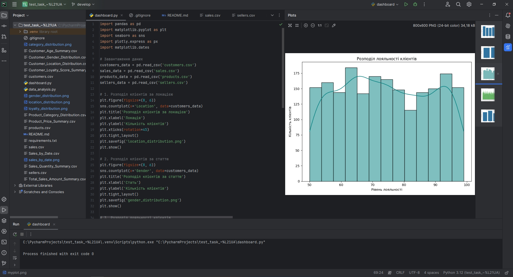

# Test Task to Startup L21UA ⚙️📊📈

Deadline: 24/08/2024, 23:59 по Києву 

Задачі:
1. Проаналізувати отримані файли (на Python) і
підготувати невеликий звіт з аналізом та висновками.
2. Побудувати на основі файлів невеликий та простий
дашборд з основними показниками, які будуть давати
менеджменту розуміння ситуації по бізнесу (в ідеалі на
Power BI, але можна і на Tableau).

## Дано файли з даними: sales.csv, sellers.csv, products.csv та customers.csv.
Опис колонок:
1. Клієнти (customers):
- a. CustomerID: Унікальний ідентифікатор клієнта
(Наприклад, 1001, 1002, 1003).
- b. Name: Ім'я клієнта (Наприклад, Іван Іванов, Олена
Петрова).
- c. Age: Вік клієнта (Наприклад, 34, 29, 45).
- d. Gender: Стать (Наприклад, Чоловік, Жінка).
- e. Location: Місцезнаходження (Наприклад, Київ, Львів,
Одеса).
- f. RegistrationDate: Дата реєстрації клієнта (Наприклад,
2023-01-15).
g. LoyaltyScore: Оцінка лояльності (Наприклад, 85, 70, 90).

2. Продажі (sales):
- a. SaleID: Унікальний ідентифікатор транзакції
(Наприклад, 5001, 5002, 5003).
- b. CustomerID: Ідентифікатор клієнта (зв’язок з таблицею
customers).
- c. ProductID: Ідентифікатор товару (зв’язок з таблицею
products).
- d. Quantity: Кількість товару (Наприклад, 2, 1, 5).
- e. SaleDate: Дата продажу (Наприклад, 2024-08-01).
- f. TotalAmount: Загальна сума продажу (Наприклад,
1500, 2000, 350).

3. Товари (products)
- a. ProductID: Унікальний ідентифікатор товару
(Наприклад, 2001, 2002, 2003).
- b. ProductName: Назва товару (Наприклад, Смартфон,
Ноутбук, Навушники).
- c. Category: Категорія товару (Наприклад, Електроніка,
Побутова техніка).
- d. Price: Ціна за одиницю товару (Наприклад, 750, 1000,
70).

# Звіт з Аналізом та Висновками 📊📈🧾:
## Аналіз даних з отриманих файлів (customers.csv, sales.csv, products.csv, sellers.csv) для виявлення основних тенденцій та висновків.

### Клієнти:
- ЛОКАЦІЯ: Клієнти розподілені приблизно однаково між містами продажу, із незначними відмінностями. 
Основні акценти спостерігаються на Києві та Львові, де клієнтів більше, в той час, як Харків має найменшу кількість клієнтів.
- СТАТЬ: Спостерігається невеликий дисбаланс у розподілі клієнтів за статтю, де жінок трохи більше, ніж чоловіків.
Загалом, розподіл є приблизно рівним між гендерами.
- ЛОЯЛЬНІСТЬ: Розподіл лояльності клієнтів виявив різні категорії користувачів, від менш до більш лояльних.
Середнє значення рівня лояльності складає 74.30, що дозволяє краще оцінити загальний рівень прихильності клієнтів та визначити сфери для підвищення їхньої лояльності.

### Продажі:
- Динаміка продажів: Графік динаміки продажів показав пікові та спадні періоди.
Це може свідчити про сезонність або вплив маркетингових активностей на кількість продажів.
- Категорії продуктів: Аналіз розподілу товарів за категоріями показав, що категорія "Аксесуари" є найбільш популярною за сумою продажів. В той час як "Електроніка" займає найнижчу позицію за обсягом продажів, категорія "Побутова техніка" знаходиться приблизно посередині.
Це дозволяє зосередити зусилля на популярних категоріях та переглянути стратегії для менш успішних.

### Продукти:
- Аналіз показав, які категорії товарів є найбільш доступними та преміальними, що дозволяє точніше визначити переваги цільової аудиторії та адаптувати стратегії продажу відповідно до їхніх потреб.

### Продавці:
- Аналіз даних вказує, що найкращі 10 продавців складають значну частку загального обсягу продажів, що підкреслює їх важливу роль у бізнес-процесах.

## Висновки:
- Проведений аналіз дозволив виявити основні тенденції в продажах та розподілі клієнтів, що дає змогу глибше зрозуміти поведінку споживачів та ефективність різних аспектів бізнесу.
- Визначені пікові періоди та ключові регіони продажів відкривають можливості для стратегічного удосконалення бізнес-процесів та таргетованих маркетингових кампаній, що може суттєво підвищити ефективність бізнесу.

